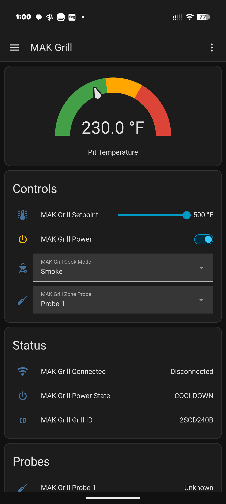
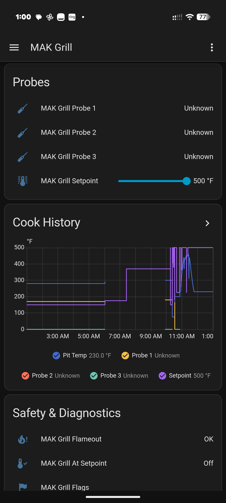

# MAK Grill — Home Assistant Integration

[](https://github.com/hacs/integration)
[](https://github.com/papac0rn/ha-mak-grill/releases)
[](LICENSE)
[](https://buymeacoffee.com/papac0rn)

Local-push Home Assistant integration for **MAK Pellet Boss WiFi** grills. No cloud dependency — the grill talks directly to your HA instance over your LAN.

> **MAK Grills has closed its doors**, but your grill still works. This integration keeps your Pellet Boss WiFi connected — locally, forever — with no cloud required.

## How it works

The Pellet Boss WiFi controller POSTs telemetry to `makgrillsmobile.com` every few seconds while running. This integration registers that same HTTP endpoint on your Home Assistant instance. A local DNS rewrite redirects the grill's traffic to HA instead of the (now-defunct) MAK cloud, giving you real-time local control with zero internet dependency.

```
┌──────────┐   POST /GrillService/Service   ┌──────────────────┐
│ MAK Grill │ ─────────────────────────────► │ Home Assistant    │
│ Pellet    │ ◄───────────────────────────── │ (your LAN)       │
│ Boss WiFi │   setPoint, cookMode, power    │                  │
└──────────┘                                 └──────────────────┘
     DNS rewrite: makgrillsmobile.com → your HA IP
```

## Screenshots

<p align="center">
  
  &nbsp;&nbsp;
  
</p>

## Features

- **Real-time telemetry** — pit temp, 3 meat probes, power state, grill flags
- **Full control** — setpoint, cook mode (Smoke/Grill/Sear), zone probe, power on/off
- **Safety** — flameout detection, cooldown interlock, auto-sync setpoint from pit temp
- **Diagnostics** — last seen timestamp, POST count, grill ID, raw flags
- **Local push** — no polling, no cloud, no latency
- **60-second timeout** — no more flickering disconnected status between slow POSTs

## Entities

| Entity | Type | Description |
|--------|------|-------------|
| Pit Temperature | Sensor | Current grill temperature (°F) |
| Probe 1 / 2 / 3 | Sensor | Meat probe temperatures (°F) |
| Power State | Sensor | Reported power state from grill |
| Grill ID | Sensor | Grill serial identifier |
| Flags | Sensor | Raw grill status flags |
| Last Seen | Sensor | Timestamp of last grill POST |
| Post Count | Sensor | Total POSTs received this session |
| Connected | Binary Sensor | Whether the grill is actively posting |
| Flameout | Binary Sensor | Flameout detection (pit temp stays 35°F below setpoint for 8 min) |
| At Setpoint | Binary Sensor | Grill has reached target temperature |
| Setpoint | Number | Target temperature (150–500°F, writable) |
| Power | Switch | Power on/off (with cooldown interlock) |
| Cook Mode | Select | Smoke / Grill / Sear |
| Zone Probe | Select | Which probe controls the zone |
| Create Dashboard | Button | One-press setup — creates a complete MAK Grill dashboard in your sidebar |

## Dashboard

After installing, go to **Settings → Devices → MAK Grill** and press the **Create Dashboard** button. A fully configured dashboard appears in your sidebar with pit temperature gauge, controls, probes, cook history graph, status, and safety/diagnostics cards.

Want to build your own instead? See the [Dashboard Guide](https://github.com/papac0rn/ha-mak-grill/wiki/Dashboard-Guide) for copy-paste YAML for each card.

## Installation

### HACS (recommended)

1. Open HACS in Home Assistant
2. Click the three dots menu → **Custom repositories**
3. Add `https://github.com/papac0rn/ha-mak-grill` with category **Integration**
4. Search for "MAK Grill" and install
5. Restart Home Assistant

### Manual

Copy the `custom_components/mak_grill` folder to your Home Assistant `config/custom_components/` directory and restart.

## Setup

### 1. DNS rewrite

Point `makgrillsmobile.com` to your Home Assistant IP on your router. The Pellet Boss controller resolves this hostname to find its server.

**Example (TP-Link Omada / ER8411):**
- Go to your router's DNS settings
- Add a static DNS entry: `makgrillsmobile.com` → `192.168.1.200` (your HA IP)

**Example (Pi-hole / AdGuard Home):**
- Add a DNS rewrite: `makgrillsmobile.com` → your HA IP

**Pro tip:** If your grill is on a separate IoT VLAN, consider adding a firewall rule to block the grill from reaching external DNS servers. This forces it to use your router's DNS (with the rewrite) and makes the connection bulletproof.

### 2. Add the integration

1. Go to **Settings → Devices & Services → Add Integration**
2. Search for **MAK Grill**
3. Enter a name for your grill
4. Done — entities appear immediately

### 3. Verify

Power on your grill. Within a few seconds, `binary_sensor.mak_grill_connected` should turn ON and temperature sensors should populate.

You can also test with curl:

```bash
curl -X POST -d "GrillId=TEST&Temp=275&Power=ON&Probe1=165&Probe2=0&Probe3=0&GrillFlags=ATSET" http://YOUR_HA_IP/GrillService/Service
```

## Protocol

The Pellet Boss WiFi controller sends form-encoded POSTs with these fields:

| Field | Description |
|-------|-------------|
| GrillId | Grill serial number |
| Temp | Pit temperature (°F) |
| Power | Power state (ON/OFF/COOL/CD) |
| Probe1–3 | Meat probe temperatures (°F) |
| GrillFlags | Status flags (e.g., ATSET) |

The integration responds with a quoted command string that sets the grill's operating parameters:

```
"setPoint=225&potStatus=&cookMode=1&zoneProbe=1&power=1"
```

## Safety features

- **Auto-sync setpoint**: On first connection, the integration syncs the HA setpoint to the grill's actual pit temperature — no more accidentally commanding 500°F when the grill is at 225°F
- **User-set tracking**: The integration only sends commands you explicitly set in HA. It never overrides the grill's own settings unless you ask it to.
- **Cooldown interlock**: You can't power on a grill that's in cooldown mode
- **Flameout detection**: Alerts if pit temp stays 35°F+ below setpoint for 8 minutes

## What's new

| Version | Changes |
|---------|---------|
| **v1.3.0** | Create Dashboard button — one-press sidebar dashboard setup; gauge shows 0°F instead of error when grill offline |
| **v1.2.0** | Flameout detection, at-setpoint indicator, 60-second timeout, auto-sync setpoint on first connection |
| **v1.1.0** | Full grill control — setpoint, cook mode, zone probe, power switch with cooldown interlock |
| **v1.0.0** | Initial release — local-push telemetry, temperature sensors, connection status |

## Works well with

- **[Grill Buddy](https://github.com/jeroenterheerdt/grillbuddy)** — "Alert me when probe 1 hits 203°F" — works with any HA temperature sensor, including the ones this integration provides
- **[meater-in-local-haos](https://github.com/R00S/meater-in-local-haos)** — Local-first cooking assistant for HA with guided cooks, AI recipe building, and cook history — just point it at your MAK Grill probe entities

## Troubleshooting

| Problem | Cause | Fix |
|---------|-------|-----|
| Grill not connecting / entities stay "unknown" | DNS rewrite not set up or not resolving | Verify `makgrillsmobile.com` resolves to your HA IP: `nslookup makgrillsmobile.com` from the grill's network |
| Entities show "unknown" but grill is on | Grill hasn't sent its first POST yet | Wait 10–15 seconds after power-on; check `binary_sensor.mak_grill_connected` |
| Flameout alert on startup | Normal — pit temp is cold and below setpoint | The alert clears once the grill heats up or after 8 minutes of normal operation |
| Dashboard gauge shows 0°F | Grill is powered off or disconnected | Expected behavior (v1.3.0+) — gauge shows 0 instead of an error when no data is available |
| Grill on different VLAN can't reach HA | Firewall blocking cross-VLAN traffic on port 80 | Add a firewall rule allowing the grill's subnet to reach HA's IP on port 80 |

For more help, see the [Troubleshooting wiki page](https://github.com/papac0rn/ha-mak-grill/wiki/Troubleshooting) or [open an issue](https://github.com/papac0rn/ha-mak-grill/issues).

## Credits

- **[bawilson2](https://github.com/bawilson2)** — Original protocol reverse-engineering and [mak-controller](https://github.com/bawilson2/mak-controller) Docker container that proved local control was possible. This integration wouldn't exist without that groundwork.
- Built with [Claude Code](https://claude.com/claude-code)

## License

MIT
